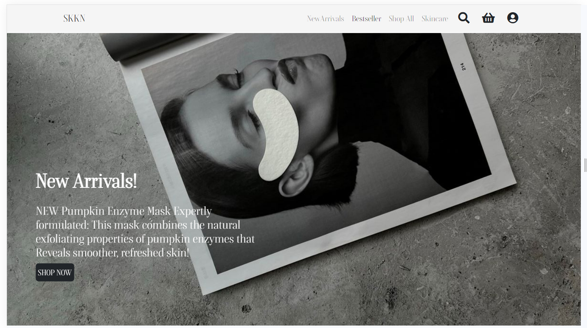
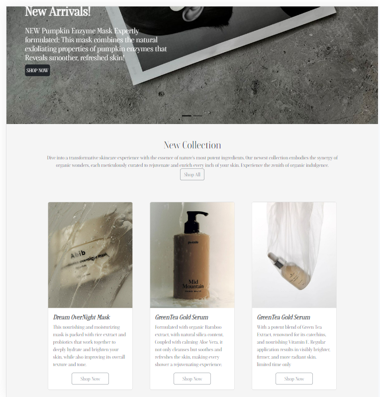
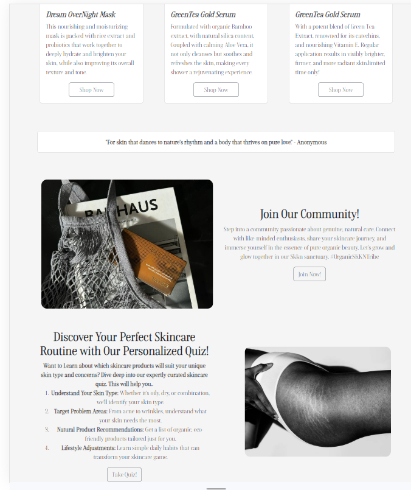
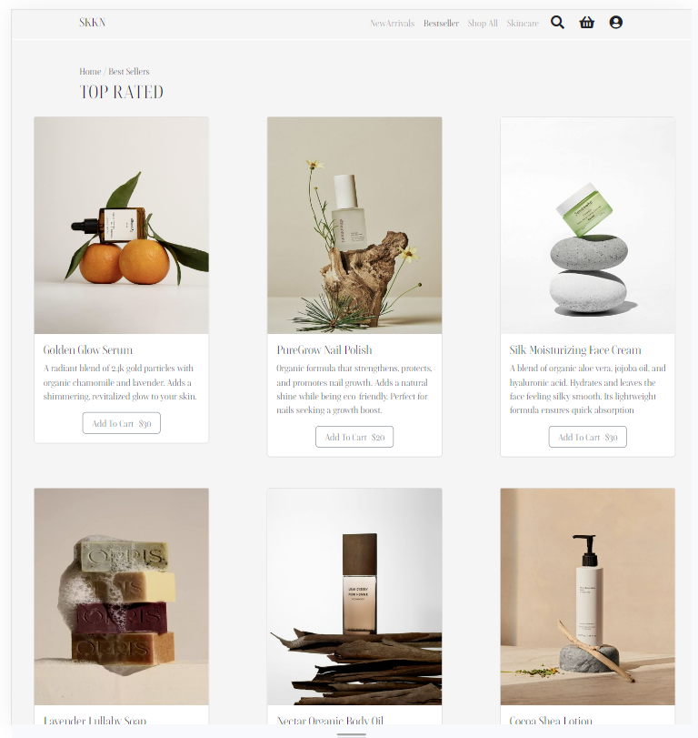
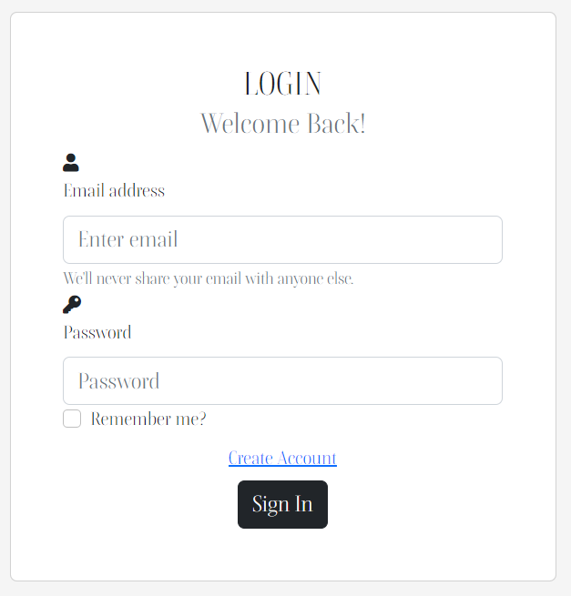
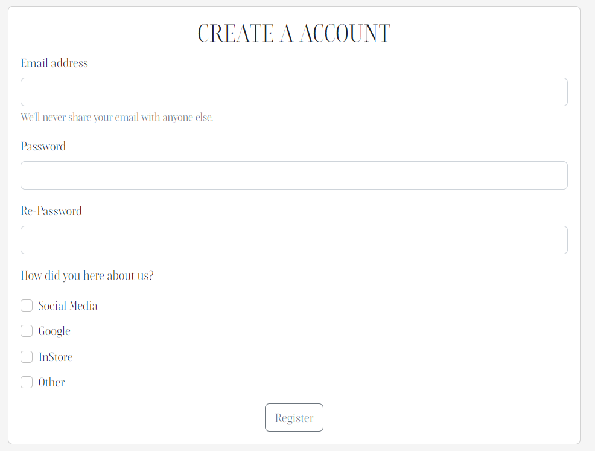
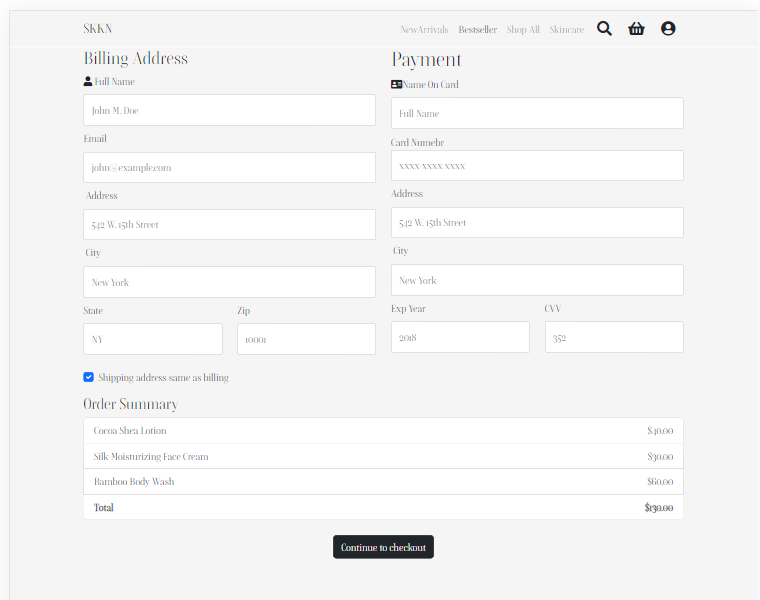

# First-Website
## SKKN
Welcome to SKKN, where skincare meets nature. We're dedicated to providing the purest, most effective skincare products designed to rejuvenate, revitalize, and bring out your natural beauty.

## About SKKN:

SKKN is not just another skincare brand; it's a lifestyle. Our products are crafted from nature's best ingredients, ensuring that each drop nurtures, hydrates, and rejuvenates your skin, all while being gentle on our planet.

## Why Choose SKKN?

- **100% Organic**: Free from harmful chemicals and additives.
- **Sustainable Packaging**: Our commitment to a greener Earth.
- **Vegan Friendly**: Products free from animal testing.
- **Suitable for All Skin Types**: Our gentle formulation ensures that everyone can benefit.

## HomepageFeatures

## HERO

Responsive Navbar: Features quick links to various sections of the site like "New Arrivals", "Bestseller", "Shop All", and "Skincare". It also includes search, cart, and user login icons.

Carousel: A slider showcasing the latest new collection and announcement with a captivating black and white image and a call-to-action button.

## BODY

 

Product Showcase: A display of the New featured products with images and short descriptions to tempt new customrs.

Inspirational Quote: A standalone section displaying a skincare-related quote to inspire visitors.

Product Overlay: Our product images feature an overlay that zooms in, providing a detailed view of the ingredients or a product sample. This ensures transparency and helps you make informed decisions about your skincare.

 

 Zig-Zag Layout: Our website layout, particularly in the blog-like sections, uses a zig-zag design. This contemporary design approach not only looks aesthetically pleasing but also makes the content engaging and easy to follow.

Join Our Community: We're more than just a skincare line; we're a community. The "Join Our Community" section invites users to become a part of our larger family, with the "join us button" Leads to the registration page.

Skin Type Quiz: With my list I created a informative We offer users the chance to take a detailed quiz that helps them understand their skin type and concerns. 

## PRODUCTPAGE

Direct Cart Access: Each product button is hyperlinked straight to checkout.html. This means that with just one click, users can swiftly move their desired items to the cart, reducing the number of steps required and offering a faster shopping process.

## lOGIN 

 The simplicity of the design ensures easy navigation and a user-friendly experience. For users who haven't created an account with us yet, there's a conveniently placed link that redirects to the registration page, making the process seamless.

## REGISTER

Upon navigating to the registration page, users are greeted with an intuitive sign-up form. One of the notable features of our registration page is the radio button set that asks users, "How did you hear about us?"

## CHECKOUT

Users can easily view an order summary, providing a clear breakdown of their purchases. 

## one interesting code

The overlay I have my product images.. When I have the time I really wanted to try it because I seen alot of the 
e-ecomm markets do this especially in beauty.. I was always fascinated and to do it was pretty cool.
I found a base image and a overlay image which will appear on hover.. both images are within a card div class 'image-container
and the images stack ontop of each other. then using css transtion like opacity:0 this means that its there but its invisible to users initially 
and the overlay opacity from 0 to 1 makes it from invisible to visible
this set set up ensures that the customer will initially see the base image while the overlay is effectivetly 
invisible and can be revealed throaugh
